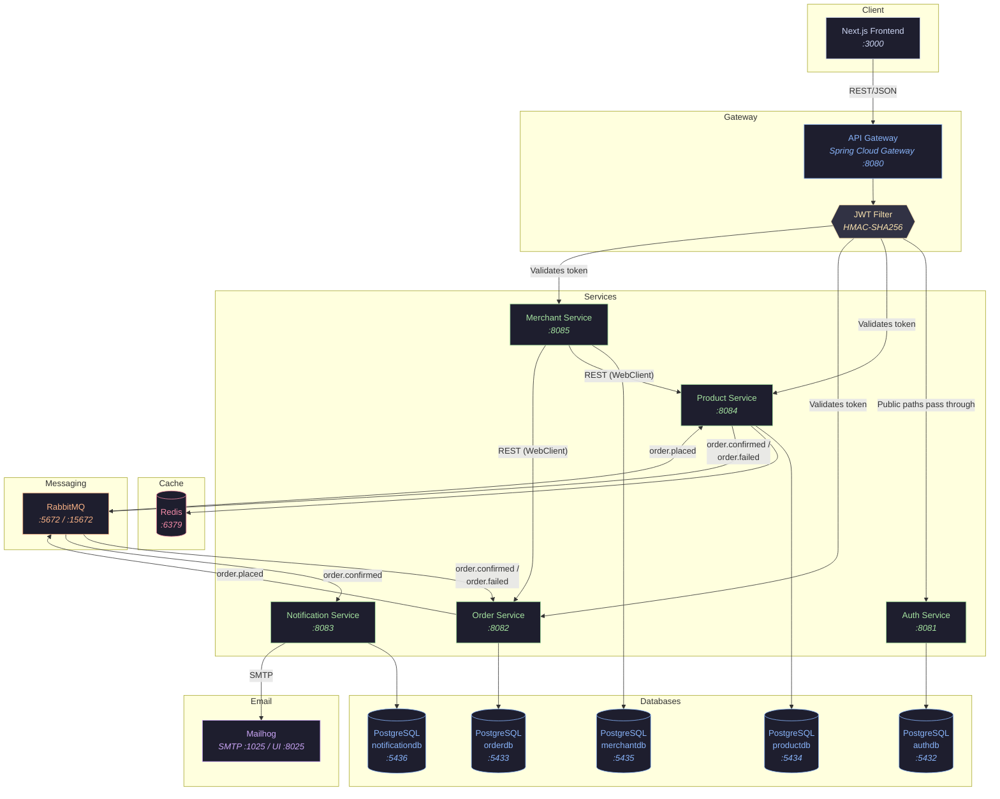
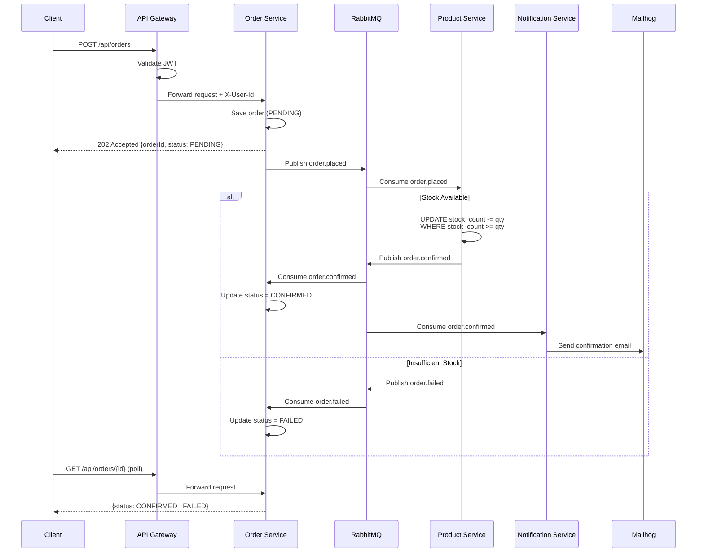
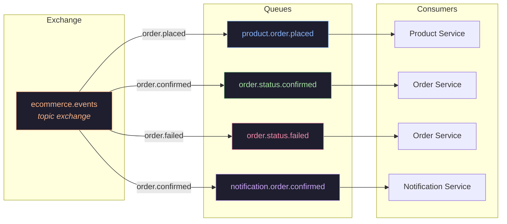

# Architecture Diagram

## System Overview



## Async Order Saga



## RabbitMQ Topology



## Service Communication Matrix

```
                    ┌──────────┐
                    │  Client  │
                    │ (Next.js)│
                    └────┬─────┘
                         │ REST/JSON
                         ▼
               ┌─────────────────────┐
               │    API Gateway      │
               │  JWT Validation     │
               │  Route Forwarding   │
               │  Swagger Aggregation│
               └──┬──┬──┬──┬──┬─────┘
                  │  │  │  │  │
         ┌────────┘  │  │  │  └────────┐
         ▼           ▼  │  ▼           ▼
    ┌─────────┐  ┌──────┤  ┌────────┐  ┌──────────┐
    │  Auth   │  │Product│  │ Order  │  │ Merchant │
    │ Service │  │Service│  │Service │  │ Service  │
    └────┬────┘  └──┬─┬─┘  └──┬──┬──┘  └──┬───┬───┘
         │          │ │        │  │         │   │
         ▼          ▼ ▼        ▼  │         │   │
    ┌────────┐  ┌─────┐┌─────┐┌──┴──┐      │   │
    │postgres│  │pg   ││Redis││pg   │      │   │
    │ auth   │  │prod ││     ││order│      │   │
    └────────┘  └─────┘└─────┘└─────┘      │   │
                   ▲                        │   │
                   │  ┌─────────────────────┘   │
                   │  │ REST (WebClient)         │
                   │  ▼                          │
                   │  Product Service ◄──────────┘
                   │                    REST (WebClient)
                   │
              ┌────┴────┐
              │RabbitMQ  │──── order.placed ────► Product Service
              │          │◄─── order.confirmed ── Product Service
              │          │──── order.confirmed ──► Notification Service
              │          │──── order.confirmed ──► Order Service
              │          │──── order.failed ─────► Order Service
              └──────────┘
                                    │
                          ┌─────────┘
                          ▼
                    ┌───────────┐
                    │  Mailhog  │
                    │ SMTP Mock │
                    └───────────┘
```
